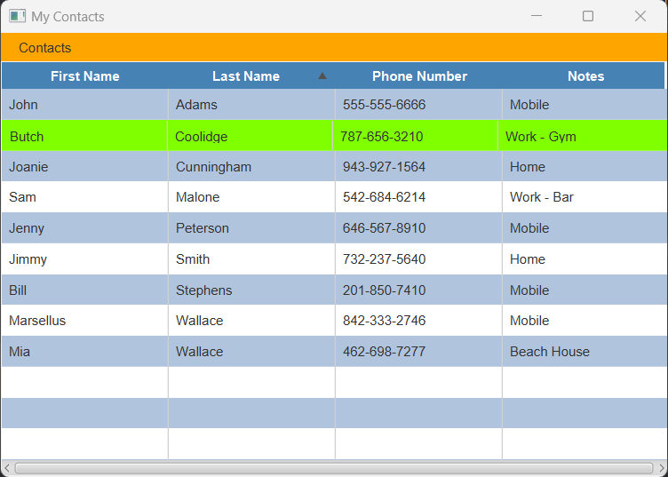

# Contacts-JavaFX 

## Description

An application for saving contacts built with JavaFX.  Add a contact, edit a contact, delete a contact.  
Uses xml file for data storage.

### App Screenshot:

## Table of Contents

- [Installation](#installation)
- [Usage](#usage)
- [License](#license)
- [Contributing](#contributing)
- [Tests](#tests)
- [Questions](#questions)

## Installation

run in JavaFX

## Usage

Use drop down menu to add, edit, or delete a contact.

## License
This application is covered under the MIT License.
 For more information: https://opensource.org/licenses/MIT

## Contributing
N/A

## Tests
N/A

## Questions
Contact Info 
GitHub user name: BillStephens2022 
Link to GitHub profile: https://github.com/BillStephens2022 
Email: stephensbill17@gmail.com
